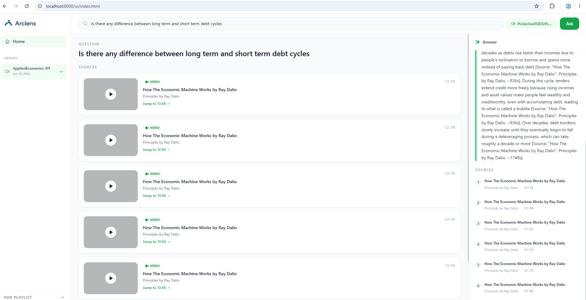

# Arclens

**Video intelligence layer over YouTube playlists.**

Ask natural-language questions about any YouTube playlist and get grounded, cited answers with direct links to the exact timestamp in the video.



---

## How it works

```
User question
     │
     ▼
retrieve       ←  Dense (Gemini embeddings) + Sparse (BM25) fused via RRF
     │               Meta-phrases stripped before retrieval; embedding model
     │               handles semantic synonyms ("lessons" ↔ "rules of thumb")
     ▼
rerank         ←  Cross-encoder (ms-marco-MiniLM-L-6-v2) scores top candidates
     │
     ▼
threshold_check ← Refuse if no chunk clears MIN_RERANK_SCORE
     │
     ▼
generate       ←  Gemini 2.5 Flash (thinking disabled) — grounded answer
     │               from retrieved chunks only
     ▼
format_citations ← Inline [Source: title, channel, ~Xs] → video_id + timestamp
     │
     ▼
Answer + clickable timestamp cards → inline YouTube player
```

### Retrieval design

The pipeline uses the same Gemini `text-embedding-004` model for both ingestion and query embedding. This means the model's semantic understanding bridges vocabulary gaps at query time — a question about "lessons to learn" finds a chunk about "rules of thumb" because both map to nearby points in embedding space. No query rewriting or keyword expansion is needed or used.

BM25 complements dense retrieval for exact-term queries (specific names, numbers, rare vocabulary). The two result sets are fused with Reciprocal Rank Fusion (RRF) before cross-encoder reranking.

---

## Features

- **Hybrid retrieval** — dense semantic search (Gemini embeddings) + BM25 lexical search, fused via RRF
- **Semantic synonym handling** — embedding model bridges paraphrases and vocabulary gaps across any domain
- **Cross-encoder reranking** — ms-marco-MiniLM-L-6-v2 scores each candidate for precise relevance ordering
- **Grounded generation** — Gemini 2.5 Flash answers only from retrieved transcript chunks; thinking mode disabled for deterministic output
- **Timestamp citations** — every claim links back to the exact second in the source video
- **Inline video player** — click any citation to watch from the cited moment without leaving the app
- **Staleness detection** — warns when a playlist hasn't been re-ingested in > 30 days
- **Debug endpoint** — `/debug/retrieve` shows per-chunk scores and active threshold in real time
- **Two-tier eval suite** — structural smoke tests for any playlist + retrieval regression tests with deliberate vocabulary-gap probes

---

## Stack

| Layer | Technology |
|---|---|
| API | FastAPI + Uvicorn |
| Orchestration | LangGraph (StateGraph) |
| LLM | Gemini 2.5 Flash (generation, thinking disabled) |
| Embeddings | Gemini `text-embedding-004` |
| Vector store | Pinecone (dense namespace per user×playlist) |
| Sparse index | BM25 (rank-bm25, persisted per playlist) |
| Reranker | sentence-transformers cross-encoder/ms-marco-MiniLM-L-6-v2 |
| Transcripts | youtube-transcript-api + pytubefix |
| Frontend | Alpine.js + Tailwind CSS (CDN, no build step) |
| Observability | LangSmith tracing + evaluation |
| Eval generation | Claude Opus 4.8 (golden dataset), Gemini Flash (smoke probes) |

---

## Getting started

### Prerequisites

- Python 3.11+
- [Google AI API key](https://aistudio.google.com/) (Gemini)
- [Pinecone API key](https://www.pinecone.io/) with a serverless index
- [LangSmith API key](https://smith.langchain.com/) (for tracing and eval uploads)
- [Anthropic API key](https://console.anthropic.com/) (for golden eval dataset generation)

### Install

```bash
git clone https://github.com/santoshkondabalraj/Arclens.git
cd Arclens
python -m venv .venv
# Windows
.venv\Scripts\activate
# macOS / Linux
source .venv/bin/activate

pip install -e ".[dev,eval]"
```

### Configure

```bash
cp .env.example .env
# Fill in your API keys in .env
```

Key settings in `.env`:

```
GOOGLE_API_KEY=...
PINECONE_API_KEY=...
PINECONE_INDEX_NAME=yt-rag-hybrid
LANGCHAIN_API_KEY=...          # LangSmith — tracing + eval uploads
ANTHROPIC_API_KEY=...          # Claude Opus — golden eval dataset generation
MIN_RERANK_SCORE=-10.0         # cross-encoder logit threshold
RERANK_TOP_N=10
DENSE_TOP_K=20
SPARSE_TOP_K=20
```

### Run

```bash
uvicorn yt_rag.api.main:app --reload
```

Open **http://localhost:8000** — the Alpine.js UI loads automatically.

---

## Usage

### 1. Ingest a playlist

Paste a YouTube playlist URL in the **Add Playlist** accordion in the sidebar and click **Ingest Playlist**. Ingestion runs in the background; the playlist appears in your Library when complete.

You can also trigger ingestion via the API:

```bash
curl -X POST http://localhost:8000/ingest \
  -H "Content-Type: application/json" \
  -d '{"playlist_url": "https://youtube.com/playlist?list=...", "user_id": "you"}'
```

Ingestion automatically generates two eval datasets in the background:
- **Smoke probes** (`data/eval_probes/{playlist_id}.json`) — 5 on-topic + 3 off-topic structural probes
- **Golden dataset** (`tests/golden_qa_{playlist_id}.json`) — 16 vocabulary-gap retrieval probes via Claude Opus (requires `ANTHROPIC_API_KEY`)

### 2. Ask questions

Select a playlist from the Library, type a question, and press **Ask**. Results appear as source clip cards with timestamps; click any card to watch the clip inline.

Questions can be phrased naturally — you do not need to match the exact vocabulary used in the video. Semantic paraphrases ("lessons", "advice", "key points", "insights") resolve to the same content as direct queries ("rules of thumb", "takeaways").

### 3. Calibrate retrieval

Use the debug endpoint to see how each chunk scores for a given question:

```bash
curl -X POST http://localhost:8000/debug/retrieve \
  -H "Content-Type: application/json" \
  -d '{"question": "What drives productivity growth?", "playlist_id": "...", "user_id": "..."}'
```

Response includes `question`, `retrieved_count`, `current_threshold`, and per-chunk scores with previews.

---

## Evaluation

The eval suite has two tiers that serve different purposes:

```
Tier 1: Retrieval regression            Tier 2: Structural smoke test
────────────────────────────            ─────────────────────────────
tests/golden_qa_{playlist_id}.json      data/eval_probes/{playlist_id}.json
Generated by Claude Opus                Generated by Gemini Flash at ingestion
Deliberate vocabulary-gap probes        Pipeline mechanics only (circular probes)
Tests synonym retrieval quality         Tests: pipeline runs, citations appear
Run manually after pipeline changes     Run after ingesting any new playlist
```

### Run Tier 1 — retrieval regression

```bash
# Generate golden dataset (if not auto-generated during ingestion)
python scripts/generate_golden_qa.py \
  --playlist-id PLxxx --user-id you

# Run regression suite (prints locally, no LangSmith required)
python scripts/run_eval_local.py \
  --playlist-id PLxxx --user-id you --local-only

# Run and upload results to LangSmith
python scripts/run_eval_local.py \
  --playlist-id PLxxx --user-id you
```

### Run Tier 2 — structural smoke test

```bash
python scripts/run_eval_local.py \
  --playlist-id PLxxx --user-id you --smoke --local-only
```

> **Note:** Tier 2 smoke probes are generated from the same chunks they retrieve, making them circular by design. They verify the pipeline is alive and the refusal gate works — they do **not** test vocabulary-gap retrieval. Always run Tier 1 to validate retrieval quality.

### View eval datasets

```bash
python scripts/view_eval_data.py --playlist-id PLxxx
```

### Upload to LangSmith for tracked experiments

```bash
python scripts/upload_golden_dataset.py --playlist-id PLxxx
python -m yt_rag.evaluation.run_eval --dataset yt-rag-PLxxx
```

### Evaluators

| Metric | Type | What it checks |
|---|---|---|
| `refusal_accuracy` | Heuristic | System refused iff `expected_refusal=true` |
| `citation_presence` | Heuristic | Every non-refusal answer has ≥ 1 citation |
| `citation_precision` | Heuristic | Citations match retrieved doc titles (not hallucinated) |
| `faithfulness` | LLM-as-judge | Answer is grounded only in retrieved context |

---

## Project structure

```
src/yt_rag/
├── api/          # FastAPI app, routes, request/response models
├── chunking/     # Token-aware text splitters
├── embeddings/   # Gemini embedding wrapper
├── evaluation/   # Evaluators, dataset upload, probe/golden generators
├── generation/   # Prompt templates + LangChain generation chain
├── graph/        # LangGraph StateGraph (nodes, state, graph wiring)
│   ├── nodes.py  # retrieve, rerank, generate, format_citations
│   ├── state.py  # RAGState TypedDict
│   └── rag_graph.py
├── ingestion/    # YouTube loader, transcript cleaner, freshness tracking
└── retrieval/    # Pinecone store, BM25 index, hybrid + cross-encoder

ui/
└── index.html    # Single-file Alpine.js + Tailwind frontend

tests/            # Unit tests + generated golden QA datasets
scripts/          # CLI tools for ingestion, evaluation, and dataset management
data/             # Runtime-generated: BM25 indexes, eval probes, ingestion metadata
```

---

## Configuration reference

| Variable | Default | Description |
|---|---|---|
| `GEMINI_FLASH_MODEL` | `gemini-2.5-flash` | Generation model |
| `GEMINI_EMBEDDING_MODEL` | `models/text-embedding-004` | Dense embedding model (used for both ingestion and query) |
| `PINECONE_INDEX_NAME` | `yt-rag-hybrid` | Pinecone index name |
| `DENSE_TOP_K` | `20` | Candidates from dense retrieval |
| `SPARSE_TOP_K` | `20` | Candidates from BM25 retrieval |
| `RERANK_TOP_N` | `10` | Top chunks passed to threshold check and generation |
| `MIN_RERANK_SCORE` | `-10.0` | Cross-encoder logit cutoff (raw logits, not 0–1) |
| `STALENESS_DAYS` | `30` | Days before a stale-corpus warning is shown |
| `BODY_CHUNK_SIZE` | `600` | Tokens per transcript chunk |
| `BODY_CHUNK_OVERLAP` | `150` | Token overlap between chunks |

> **Note on `MIN_RERANK_SCORE`:** the ms-marco cross-encoder outputs raw logits, not probabilities. Scores above `0` are directly relevant; `-5 to 0` is same-domain and topically related; `-10 to -5` covers semantic synonym matches (e.g. "lessons" finding a "rules of thumb" chunk). `-10.0` is the current cutoff. Off-topic queries (e.g. geography against an economics corpus) score below `-13` and are correctly refused.

---

## License

MIT
